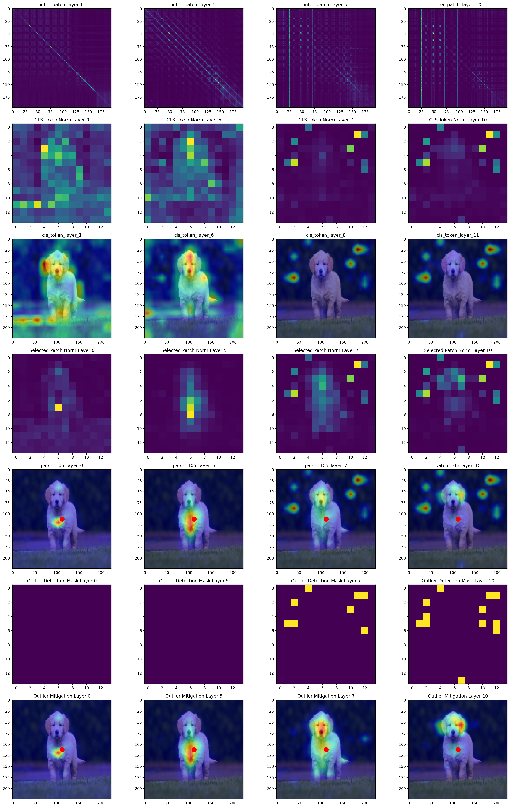

## Feature Purificatrion Matters: Supressing outlier propagation for training-free open-vocabulary semantic segmentation, ICCV25

This repository contains the code for our **ICCV 2025 highlight** paper, [Feature Purificatrion Matters: Supressing outlier propagation for training-free open-vocabulary semantic segmentation](https://openaccess.thecvf.com/content/ICCV2025/papers/Jin_Feature_Purification_Matters_Suppressing_Outlier_Propagation_for_Training-Free_Open-Vocabulary_Semantic_ICCV_2025_paper.pdf).

[](https://github.com/Kimsure/SFP)    [](https://openaccess.thecvf.com/content/ICCV2025/papers/Jin_Feature_Purification_Matters_Suppressing_Outlier_Propagation_for_Training-Free_Open-Vocabulary_Semantic_ICCV_2025_paper.pdf) <a href="#LICENSE--citation"></a>

## Abstract

Training-free open-vocabulary semantic segmentation has advanced with vision-language models like CLIP, which exhibit strong zero-shot abilities. However, CLIP’s attention mechanism often wrongly emphasises specific image tokens, namely outliers, which results in irrelevant over-activation. Existing approaches struggle with these outliers that arise in intermediate layers and propagate through the model, ultimately degrading spatial perception. In this paper, we propose a Self-adaptive Feature Purifier framework (SFP) to suppress propagated outliers and enhance semantic representations for open-vocabulary semantic segmentation. Specifically, based on an in-depth analysis of attention responses between image and class tokens, we design a selfadaptive outlier mitigator to detect and mitigate outliers at each layer for propagated feature purification. In addition, we introduce a semantic-aware attention enhancer to augment attention intensity in semantically relevant regions, which strengthens the purified feature to focus on objects. Further, we introduce a hierarchical attention integrator to aggregate multi-layer attention maps to refine spatially coherent feature representations for final segmentation. Our proposed SFP enables robust outlier suppression and object-centric feature representation, leading to a more precise segmentation. Extensive experiments show that our method achieves state-of-the-art performance and surpasses existing methods by an average of 4.6% mIoU on eight segmentation benchmarks.


## Visualization of Outlier Propagation
You can check and verify the attention outlier at [Notebook](outlier_vis.ipynb).




## Installation
```
git clone https://github.com/Kimsure/SFP.git
cd SFP
```

### 1) Recommended

Please use the following commands to install the same conda environment.
```
conda env create f environment.yml
```

### 2) Manual Setup

If the above YAML file can't work properly, you can manually install the following required packages.

```
conda create -n sfp_ovss python=3.9
conda activate sfp_ovss
pip install torch==2.0.0 torchvision==0.15.1
pip install scikit-learn scikit-image
pip install mim # if error occurs when installing mim, please try pip install openmim
mim install mmcv==2.0.1 mmengine==0.8.4 mmsegmentation==1.1.1
pip install ftfy regex numpy==1.26.4 yapf==0.40.1
```

## Datasets
We include the following dataset configurations in this repo:

**With background class**: PASCAL VOC, PASCAL Context, Cityscapes, ADE20k, and COCO-Stuff164k,

**Without background class**: VOC20, Context59 (i.e., PASCAL VOC and PASCAL Context without the background category), and COCO-Object.

Plase follow [SCLIP](https://github.com/wangf3014/SCLIP) and [mmsegentation_document](https://github.com/open-mmlab/mmsegmentation/blob/main/docs/en/user_guides/2_dataset_prepare.md) for detailed configurations.

## Quick Start
We currently provide a visualization notebook to evaluate the outler detector. You can check and verify it at [NOTEBOOK](outlier_vis.ipynb).

## Inference
You can use the following bash scripts to evaluate our SFP (on RTX4090 or other GPU devices). Remember adjusting your own **MODEL/DATASET PATH**. 

Single inference 
```
sh test.sh
```

Multiple inference 
```
sh multi_test.sh
```

Distributed inferece 
```
sh distribute_test.sh
```

### Ablations

You may want to check and reproduce the visualization results shown in out [NOTEBOOK](outlier_vis.ipynb). Please turn to [base_config.py](./configs/base_config.py) and use **'purify'** and **'pm'** to control whether to use outlier detection and its various methods.

## TODOs
We are still organizing our codes and will release the remaining parts once ready. Please stay tuned.

- [x] Preprare demo for outlier detection to help other researchers
for visualization

- [x] Prepare our proposed modules, SOF, etc.

- [x] Extend our SFP via other outlier detection approaches

  - [x] cls/self attn (also employed by [SegEarth-OV](https://arxiv.org/abs/2410.01768))

  - [x] L2 norm sort (employed by [ViT-Register](https://arxiv.org/abs/2309.16588))
 
  - [x] LOF (employed by [SC-CLIP](https://arxiv.org/abs/2411.15869v2))

  - [ ] DBSCAN as well as other cluster methods

## Citations
If you find our work useful, please cite this paper:
```
@inproceedings{jin2025feature,
  title={Feature Purification Matters: Suppressing Outlier Propagation for Training-Free Open-Vocabulary Semantic Segmentation},
  author={Jin, Shuo and Yu, Siyue and Zhang, Bingfeng and Sun, Mingjie and Dong, Yi and Xiao, Jimin},
  booktitle={Proceedings of the IEEE/CVF International Conference on Computer Vision (ICCV)},
  pages={20291--20300},
  year={2025}
}
```

## Acknowledgement
This repository was developed based on [CLIP](https://github.com/openai/CLIP), [CLIPtrase](https://github.com/leaves162/CLIPtrase), [SCLIP](https://github.com/wangf3014/SCLIP), [SC-CLIP](https://github.com/SuleBai/SC-CLIP), [mmsegmentation](https://github.com/open-mmlab/mmsegmentation) etc. Thanks for their great works!
